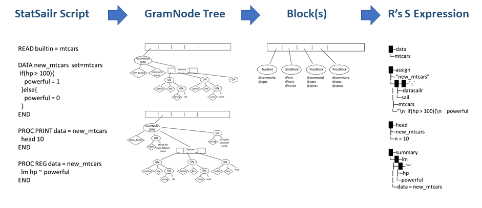

# Summary

StatSailr is a platform for data processing and statistics, where users write StatSailr scripts and StatSailr processes data sets and applies statistical procedures following the scripts. The backend engine of StatSailr is GNU R [@R; @ihaka:1996], so the results are reliable. SataSailr script is designed to be easy to learn and easy to read. It consists of three major blocks, TOPLEVEL, DATA and PROC. TOPLEVEL controls StatSailr's system environment and also imports and exports data sets. DATA blocks process imported data sets, such as updating values, adding new columns and extracting patterns of character sequences. PROC blocks conduct descriptive analysis and inferential analysis for imported data sets. Each block has its way of writing instructions, and is finally converted to R's internal structures, which are evaluated by R. StatSailr with its simple scripting aims to provide free, opensource, reproducible and easy statistics environment. StatSailr's main project page is available at [https://statsailr.io](https://statsailr.io)


# Statement of Need

There are already many commercial and opensource statistics software. Among them, R provides a free opensouce statistics environment with robustness, reliablity and reproducibility. R itself has a flexibility as a general-purpose programming language and also enables users to use state-of-the-art statistical methods through its additional package system.

In statistics and research field, some people have strong knowledge about computer programming and statistics, but some people want to use statistics software for simple tasks, such as filtering data set and applying built-in statistical procedures. For those tasks, R can be overpowered and requires users efforts to learn the language. StatSailr with its simple scripting aims to provide free, opensource, reproducible and easy statistics environment.


# Overview of StatSailr

StatSailr program is a Ruby program which translates StatSailr script into R's internal structures and asks R to evaluate them. The program is distributed using Ruby's package management system called RubyGems. StatSailr is provided as statsailr gem, which contains a command to execute StatSailr scripts and also a command to exeucute them interactively (i.e. REPL). 

Internally, as the \autoref{fig:statsailr_internal_flow} shows, StatSailr scripts are converted through some steps. First, the script is tokenized, parsed and converted into an array of tree-like structures, many of which are composed of objects called GramNode. Second, the GramNode based structures are converted into an array of Block objects, TopStmt, DataBlock or ProcBlock. Finally, the array is converted into R's internal S expressions, and those S expressions are evaluated. 




# StatSailr Script

SataSailr scripts consist of three major parts or blocks, TOPLEVEL, DATA, and PROC. TOPLEVEL controls system environment such as working directory and data management of importing and exporting data. DATA blocks process imported data sets including updating values, adding new columns and extracting patterns of character sequences. PROC blocks conduct descriptive analysis (e.g. printing out data sets, univariate and categorical variable analysis, and plotting) and inferential analysis (e.g. regression analysis and statistical tests). If you have experience with SAS software[^1][@sas1985sas] or World Programming[@WorldProgramming]], you are familiar with this structure.

[^1]: SAS and all other SAS Institute Inc. product or service names are registered trademarks or trademarks of SAS Institute Inc. in the USA and other countries.

In the following example TOPLEVEL READ command imports R's built-in dataset, mtcars, which holds infomrtion of classic cars. DATA block adds a new column, powerful, based on the values of hp (horse power) column, and name the result data set as new_mtcars. PROC PRINT block shows the first ten rows of the newly created new_mtcars data set. PROC REG executes linear regression analysis for new_mtcars data set. Finally, TOPLEVEL SAVE command saves new_mtcars data set as a new_mtcars.rda file.


```
READ builtin="mtcars"

DATA new_mtcars set=mtcars
  if(hp > 100){
    powerful = 1
  }else{
    powerful = 0
  }
END

PROC PRINT data=new_mtcars
  head 10
END

PROC REG data=new_mtcars
  lm hp ~ powerful
END

SAVE new_mtcars file="./new_mtcars.rda" type="rdata"
```

You can execute the example code above using 'sailr' command.

```
sailr example.slr
```

You can also execute codes interactively using 'sailrREPL' command. Details of how to use 'sailr' and 'sailrREPL' are described in [statsailr README](https://github.com/niceume/statsailr/blob/main/README.md)


The default PROCs are implemented as a separate gem called statsailr\_procs\_base. There are more PROCs available, and each PROC has its purpose. For example, PROC PRINT shows data set, PROC UNI conducts univariate analysis, PROC CAT conducts categorical variable analysis, and PROC REG conducts linear regression analysis. To realize these PROC aims, each PROC has their own instructions implemented. Available default PROC commands and instructions are listed in documentation of [statsailr website](https://statsailr.io). 

The statsailr\_procs\_base gem can work as a template when you develop your own PROC gems. Implementation codes are available on [Github](https://github.com/niceume/statsailr_procs_base). You can specify your custom PROC gem when running sailr or sailrREPL command with \-\-procs\-gem option.


# Acknowledgements

I would like to thank my family, Yuki, Joichiro and Kaoruko for always giving me joy.

# References


